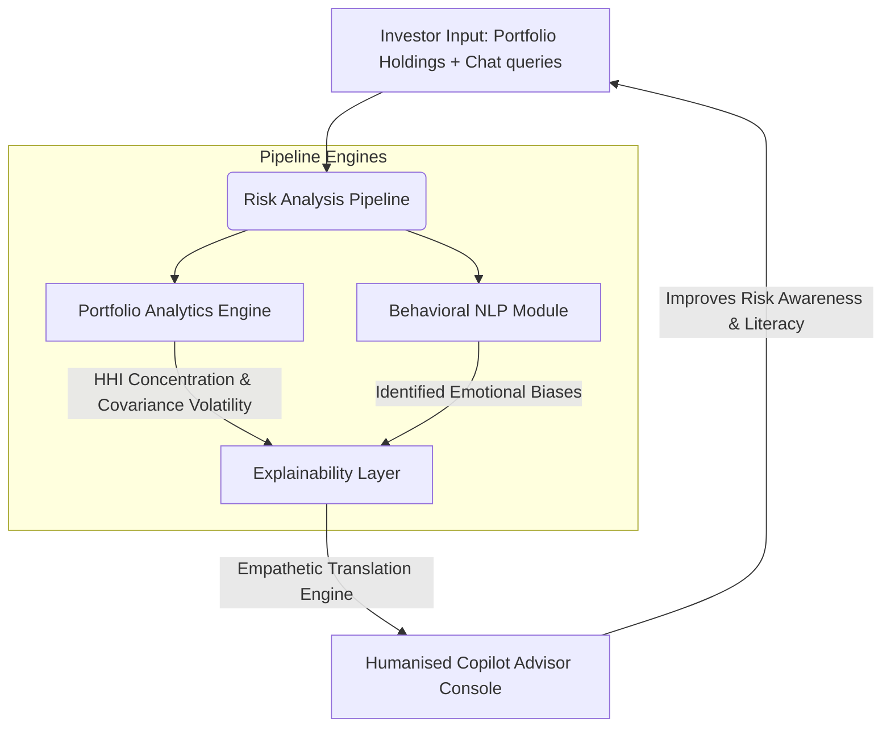

# AI Financial Risk Copilot for Teen and Small Investors
## A Human-Centered Explainable AI Framework for Safer Retail Investing

### Author
**Rignesh P**

[](LICENSE)
[](app/backend/main.py)
[](app/backend/main.py)
[](app/frontend/index.html)
[](#contributing)

<p align="center">
  
</p>

Democratizing retail finance through commission-free trading apps and online social media communities has enabled millions of teen and small investors to access financial markets. However, it has also exposed them to catastrophic psychological and financial hazards. Beginner investors frequently fall victim to behavioral biases—such as fear of missing out (FOMO), panic selling, overconfidence, and revenge trading—leading to concentrated, high-volatility portfolios and severe capital drawdowns.

The **AI Financial Risk Copilot** is a human-centered, explainable artificial intelligence (XAI) framework designed to act as a real-time behavioral counterweight and educational mentor. Unlike standard robo-advisors that focus strictly on maximizing algorithmic returns, this system prioritizes **investor safety, behavioral analysis, risk awareness, and humanised financial education**.

---

## 🌟 Key Features

*   **Interactive Portfolio Sandbox**: A live environment allowing users to simulate portfolio holdings and view the instant impact of allocations on concentration and volatility.
*   **Behavioral NLP Sentiment Classifier**: An NLP engine scanning conversational queries for emotional indicators (FOMO, Loss Aversion, Overconfidence, Recency Bias).
*   **Composite Investor Safety Score ($ISS$)**: A multi-dimensional risk index combining quantitative concentration ratios and asset volatility with qualitative emotional markers.
*   **Empathetic Translation Layer (XAI)**: An NLG module translating cold mathematical parameters (HHI, Covariance standard deviations, negative Sharpe Ratios) into warm, relatable, jargon-free explanations.
*   **5-Year Visual Scenario Simulator**: An interactive line chart demonstrating capital projection trajectories (Expected Growth vs Speculative Peaks vs severe Plunge corrected curves) based on user portfolio risk.

---

## 🛠️ System Architecture

The AI Risk Copilot framework processes inputs through a four-stage sequential pipeline to deliver compassionate, risk-aware guidance:



---

## 🔬 Experimental Research Variables (IV, CV, DV)

To evaluate whether a human-centered, explainable framework successfully shields beginner investors, the underlying study designs a clinical-style comparative trial:

<p align="center">
  
</p>

### Independent Variable (IV)
The core intervention manipulated in the research experiment:
*   **Level 1 (Treatment Group)**: Interaction with a trading console integrated with the **AI Financial Risk Copilot** (featuring live diversification health charts, behavioral alerts, and explainable chat advice).
*   **Level 2 (Control Group)**: Interaction with a standard **Traditional Robo-Advisor Interface** (displaying cold quantitative returns, asset weights, and standard generic risk disclosures).

### Dependent Variables (DVs)
Objective, measurable outcomes of participant trading behavior:
1.  **Diversification Quality ($D_{qual}$)**: Measured as $(1 - HHI_{port})$, quantifying the investor's avoidance of concentrated assets.
2.  **Emotional Trade Frequency ($F_{emo}$)**: The rate of panic-driven or trend-chasing trades triggered by the user.
3.  **Financial Literacy Score Delta ($\Delta L$)**: The knowledge improvement measured by identical pre- and post-trial concept examinations: $\Delta L = L_{post} - L_{pre}$.
4.  **Risk-Adjusted Return ($SR_p$)**: The annualized Sharpe Ratio achieved by the investor.

### Control Variables (CVs)
Crucial constants maintained to isolate the true causal impact of the AI Copilot:
*   **Market Environment**: Simulated 30-day historical high-volatility market correction scenario.
*   **Starting Capital**: Identical virtual paper balance of **$10,000 USD** for all participants.
*   **Asset Universe**: Standardized choice list of 35 financial securities (20 blue-chips, 10 cryptos/meme stocks, 5 broad indexes).
*   **Demographic Profile**: Young retail investors aged 16–25 with under 1 year of actual trading experience.

---

## 📊 Core Statistical Metrics & Formulas

The quantitative risk calculations are governed by standard mathematical formulations:

### 1. Herfindahl-Hirschman Concentration Index ($HHI$)
$$HHI = \sum_{i=1}^{N} w_i^2$$
Where $w_i$ is the weight of asset $i$ as a decimal fraction of the total portfolio ($\sum w_i = 1.0$).
*   **Diversification Health Score ($DHS$)**: $(1 - HHI) \times 100$

### 2. Portfolio Volatility ($\sigma_p$)
$$\sigma_p = \sqrt{\mathbf{w}^T \mathbf{\Sigma} \mathbf{w}} = \sqrt{\sum_{i=1}^N \sum_{j=1}^N w_i w_j \sigma_{ij}}$$
Where $\mathbf{w}$ is the vector of portfolio weights and $\mathbf{\Sigma}$ is the asset covariance matrix ($\sigma_{ij}$ representing the covariance between asset $i$ and $j$).
*   **Volatility Risk Factor ($VRF$)**: \min\left(100, \, \frac{\sigma_p}{\sigma_{benchmark}} \times 50\right) relative to S&P 500 volatility ($\sigma_{benchmark} \approx 15\%$).

### 3. Composite Investor Safety Score ($ISS$)
$$ISS = 100 - \left( \alpha \cdot CR + \beta \cdot VRF + \gamma \cdot \mathcal{B} \right)$$
*   $CR$ (Concentration Risk) = $HHI \times 100$
*   $VRF$ (Volatility Risk Factor) = 0 to 100
*   $\mathcal{B}$ (Behavioral Risk Score) = sentiment NLP classification output (25 to 100)
*   Weights: $\alpha = 0.40, \, \beta = 0.35, \, \gamma = 0.25$

---

## 💬 Humanising the Math: Empathetic Translation

Rather than showing dry parameters, the framework automatically maps technical formulas into humanised metaphors:

| Statistical Metric | Technical Alert (Standard Robo) | Empathetic Translation (AI Copilot) | Real-World Metaphor |
| :--- | :--- | :--- | :--- |
| **High HHI** ($> 0.6$) | *"Diversification sub-optimal."* | **"You have a lot riding on one asset."** *"If this company stumbles, your whole savings take a hit. Let's spread your holdings."* | *"Putting all your glass eggs in one fragile basket."* |
| **High Volatility** ($> 35\%$) | *"Standard deviation out of bounds."* | **"Your portfolio is on a rollercoaster."** *" Swings are rapid. Let's add some steady anchors to smooth out the ride."* | *"Riding a wild rollercoaster without a seatbelt."* |
| **NLP Panic Tag** ($\mathcal{B} \ge 70$) | *"Loss aversion flag active."* | **"It is natural to feel anxious when prices dip."** *"Panicking locks in losses. Let's take a deep breath and look at long-term history."* | *"Checking the weather every 5 seconds during a storm."* |

---

## 📂 Repository Structure

The workspace is organized into modular files making it developer and researcher-ready, with no absolute local folder references:

```txt
ai-risk-copilot/
├── README.md               # Premium project hub (This file)
├── LICENSE                 # Open-source MIT License
├── .gitignore              # Multi-stack ignoring rules (.venv, node_modules, .DS_Store)
├── app/                    # Application development root
│   ├── frontend/           # Stunning interactive web app demo
│   │   ├── index.html      # Glassmorphic layout (Sandbox + Chat console)
│   │   ├── styles.css      # Premium dark-theme styles
│   │   └── app.js          # Sliders, donut charts, sentiment NLP
│   └── backend/            # Production-ready Python FastAPI prototype
│       ├── main.py         # FastAPI endpoints for HHI, sentiment, and ISS
│       └── requirements.txt# Python backend dependencies
└── research/               # Academic research root
    ├── whitepaper/         # Rigorous academic-grade paper
    │   ├── ai_financial_risk_copilot.md # Whitepaper markdown source
    │   └── assets/         # Whitepaper image resources (experimental variables, logo)
    ├── notebooks/          # Step-by-step Python mathematics demo
    │   └── risk_copilot_demo.ipynb # Jupyter notebook for metrics verification
    └── datasets/           # Mock simulated datasets
        └── simulated_conversations.json # Demographic-mapped training corpus
```

---

## 🚀 Quickstart Guide

### 1. Launch the Interactive Web Application (Instant)
The frontend dashboard is designed to run locally in any browser with **zero dependencies or compile scripts**.
1. Open the relative file `app/frontend/index.html` directly in Google Chrome, Safari, or Microsoft Edge.
2. Drag the asset sliders in the **Sandbox** (left) to see allocations, DHS scores, and the scenario projection chart update live.
3. Select any **Simulate Bias** preset button or type a custom emotional sentence in the chat box to activate the behavioral alert tags and safety gauges!

### 2. Run the FastAPI Backend Prototype
To execute the API services locally:
1. Ensure Python 3.8+ is installed.
2. Navigate to the `app/backend` folder and install dependencies:
   ```bash
   pip install -r requirements.txt
   ```
3. Start the local server:
   ```bash
   uvicorn main:app --reload
   ```
4. Access the API documentation at: `http://127.0.0.1:8000/docs`

### 3. Open the Research Notebook
To run the python mathematical sandbox:
1. Ensure Jupyter or VS Code Jupyter extensions are installed.
2. Open the relative file `research/notebooks/risk_copilot_demo.ipynb`.
3. Execute the code blocks top-to-bottom to verify the HHI concentration and portfolio volatility covariance matrix plotting routines.

---

## 📜 License

This project is licensed under the terms of the [MIT License](LICENSE).

## 📝 Citation & Contact

If you use this framework or methodology in your academic studies, please cite:
```txt
Padamanur, R. (2026). AI Financial Risk Copilot for Teen and Small Investors: A Human-Centered Explainable AI Framework for Safer Retail Investing.
```
For inquiries, pull requests, or research collaborations, please open a GitHub Issue or reach out to the author **Rignesh P**.
