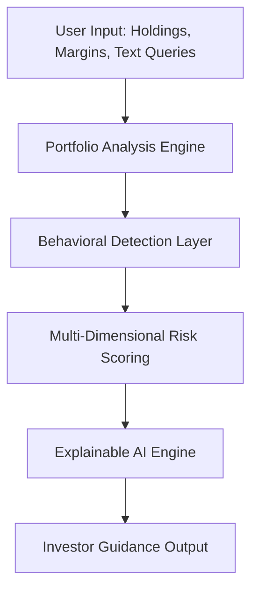

# AI Financial Risk Copilot for Teen and Small Investors
## An AI-Powered Investor Safety and Financial Cognition Framework

### Author
**Rignesh P**

[](LICENSE)
[](app/backend/main.py)
[](app/backend/main.py)
[](app/frontend/index.html)
[](#contributing)

<p align="center">
  
</p>

---

## 🎯 Strategic Positioning: What This Is

> [!IMPORTANT]
> **Regulatory and Framework Disclaimer**:
> This repository is **not** an investment advisor, speculative trading bot, or portfolio manager. It is explicitly positioned as an **AI-powered investor safety and financial cognition framework**. The project serves as an applied AI research platform exploring how explainable AI (XAI) and behavioral diagnostics can protect inexperienced retail participants from cognitive vulnerabilities and extreme capital drawdowns.

---

## 💡 Why This Matters: Research Framing

Democratizing retail finance through commission-free trading apps and viral social media communities has enabled millions of teen and small investors to access financial markets. However, it has simultaneously exposed them to significant financial and psychological hazards. Gamified trading interfaces encourage frequent, high-risk transactions, while digital forums create powerful positive feedback loops.

Traditional financial risk metrics (like standard deviation, beta, or tracking error) are typically presented in cold, non-interactive charts. Inexperienced investors experience a **cognitive block** when presented with these metrics, leading them to ignore risk warnings entirely.

**This project explores how explainable AI systems can reduce harmful retail investing behavior through behavioral analysis, contextual financial education, and risk-aware portfolio intelligence.** 

By converting complex mathematical risk equations into empathetic, humanised natural language analogies, the AI Financial Risk Copilot acts as a **cognitive circuit-breaker**. It validates user emotional states, details risk in everyday terms, and encourages long-term rational rebalancing—bridging the gap between computational finance and behavioral systems engineering.

---

## 🛠️ Advanced System Architecture

The cognition framework processes user inputs through a six-stage sequential pipeline:



1.  **User Input**: Ingests asset allocations, margin borrow factors, high-liquidity cash ratios, and conversational chat queries.
2.  **Portfolio Analysis Engine**: Computes HHI concentration index and historical covariance volatilities using live-updating market parameters.
3.  **Behavioral Detection Layer**: Scans user text inputs using NLP sentiment dictionaries to isolate cognitive biases (Loss Aversion, FOMO, Overconfidence).
4.  **Risk Scoring System**: Combines portfolio exposures and conversational sentiment into our proprietary six-category model.
5.  **Explainable AI (XAI) Engine**: Converts raw numbers into humanised analogies using templates and LLM guidance.
6.  **Investor Guidance Output**: Delivers dynamic safety scorecards, radar profile charts, color-coded heatmaps, and action directives.

---

## 💬 Visible AI Outputs & Case Studies

To demonstrate the structural sophistication of the framework, we outline two core case study outputs generated by the AI:

### Case Study 1: Asymmetric Momentum Portfolio (Risk Analysis Example)

*   **User Portfolio Input**: 80% Tesla ($TSLA$), 20% Bitcoin ($BTC$). Margin: 1.0x (None). High-Liquidity Cash: 5%.
*   **System Diagnostics**:
    *   **HHI Concentration Index**: $0.80^2 + 0.20^2 = 0.68$ (Diversification score DHS is a poor `32.0 / 100`).
    *   **Estimated Portfolio Volatility**: `43.2%` (Critical; S&P 500 baseline is 15%).
    *   **Composite Investor Safety Score (ISS)**: **`41 / 100`** (Hyper Speculative).

```txt
=========================================
AI RISK EXPOSURE DIAGNOSTICS: CASE 1
=========================================
[Detected Risks]
- High concentration exposure (80% capital in TSLA)
- Elevated volatility risk (Annualized volatility 43.2%)
- Correlated speculative assets (TSLA and BTC exhibit high covariance)

[Behavioral Signals]
- Aggressive growth positioning (momentum chasing)
- Elevated emotional exposure potential (correction will trigger panic selling)

[AI Safety Recommendation]
- Increase diversification: Lower TSLA slider to 25%
- Reduce correlated risk exposure
- Add defensive allocation: Move 45% into broad market index mutual funds
=========================================
```

> **Explainable AI Output**:
> ⚠️ **"You have a massive amount riding on just one asset."**
> *Placing 80% of your savings in TSLA is like riding a high-speed motorcycle without a helmet. It feels fast and exciting, but a single unexpected bump will cause severe damage to your wealth. Let's look at lowering your TSLA slider to 25% and shifting that capital into broad index mutual funds to build a protective financial cushion.*

---

### Case Study 2: Emotional Loss Distress (Behavioral & Revenge Trading Example)

*   **User Chat Input**: *"I lost $1,500 on meme stocks yesterday. I'm panic-selling everything to buy highly leveraged margin options and get it back immediately!"*
*   **System Diagnostics**:
    *   **NLP Sentiment Triggers**: Revenge Trading Index (`95/100`), Loss Aversion/Panic (`90/100`).
    *   **Composite Behavioral Risk Score ($\mathcal{B}$)**: **`95 / 100`** (Critical).

```txt
=========================================
AI BEHAVIORAL SAFETY DIAGNOSTICS: CASE 2
=========================================
[Detected Signals]
- Revenge trading tendency (urgent desire to recover loss)
- Emotional distress (panic response to market downturn)
- Elevated impulsive behavior risk (high probability of total wipeout on margin)

[AI Safety Guidance]
- Avoid increasing position size emotionally: Freeze active trades for 24 hours
- Review long-term investment goals: Portfolio volatility swings are normal
- Consider cooling-off period: Suggest resetting margin borrow to 1.0x (None)
=========================================
```

> **Explainable AI Output (Cognitive Circuit-Breaker)**:
> 🛑 **"It is completely natural to feel distressed when your hard-earned money dips."**
> *Psychological studies prove that the pain of a loss feels twice as sharp as the joy of a win. Our brains are hardwired to panic in these moments and take wild risks to 'get it back'. But executing leveraged options trades in a panic is like speeding through heavy rain: high danger, very little progress. Let's reset your margin slider to 1.0x and review your long-term 5-year strategy together.*

---

## 📊 The Proprietary ISS Scoring Framework

The central risk indicator is the **Investor Safety Score (ISS)**, a composite metric evaluating **six core risk categories**:

$$ISS = 100 - \left( w_{con} \cdot CR + w_{vol} \cdot VR + w_{liq} \cdot LR + w_{lev} \cdot LEV + w_{emo} \cdot \mathcal{B} + w_{div} \cdot DR \right)$$

1.  **Concentration Risk ($CR$)** ($w_{con} = 0.25$): Portfolio concentration index $HHI \times 100$.
2.  **Volatility Risk ($VR$)** ($w_{vol} = 0.20$): Portfolio standard deviation $\sigma_p$ relative to S&P 500 baseline (15%).
3.  **Liquidity Risk ($LR$)** ($w_{liq} = 0.10$): Proportion of assets held in illiquid or high-spread holdings.
4.  **Leverage Exposure ($LEV$)** ($w_{lev} = 0.15$): Margin borrowed and options leverage multiplier factors.
5.  **Emotional Risk ($\mathcal{B}$)** ($w_{emo} = 0.20$): NLP sentiment parsed bias coefficients.
6.  **Diversification Score ($DR$)** ($w_{div} = 0.10$): Average correlation profile among assets.

---

## 🎨 Visual UX Dashboards

To overcome the cognitive block of retail investors, the framework implements a premium visual UI:

1.  **Diversification Donut Chart**: Dynamic canvas showing asset allocation weight splits.
2.  **Concentration Heatmap**: A color-coded grid highlighting individual asset exposures (Safe ➔ green, Elevated ➔ amber, Critical ➔ glowing red).
3.  **Volatility Risk Gauge**: A circular neon arc showing historical price swings relative to benchmark indices.
4.  **Investor Safety Score Card**: A detailed breakdown card displaying individual weights for Concentration, Volatility, Liquidity, Leverage, and Behavioral Risk.
5.  **Emotional-Risk Radar Chart**: A five-axis canvas plotting *FOMO*, *Revenge Trading*, *Overconfidence*, *Recency*, and *Rationality* live as users interact.

---

## 📂 Repository Structure

The workspace organizes application code and academic research into separate, modular folders:

```txt
ai-risk-copilot/
├── README.md               # Premium project hub (This file)
├── LICENSE                 # Open-source MIT License
├── .gitignore              # Multi-stack ignore rules (.venv, node_modules)
├── app/                    # Application development root
│   ├── frontend/           # Visual UI dashboard (HTML, CSS, JS)
│   │   ├── index.html      # Donut charts, heatmap grid, radar canvas
│   │   ├── styles.css      # Sleek dark-mode HSL styles
│   │   └── app.js          # Interactive slider-balancer & radar canvas math
│   └── backend/            # Python FastAPI prototype
│       ├── main.py         # REST endpoints for portfolio HHI, sentiment, and ISS
│       └── requirements.txt# Backend dependencies (fastapi, uvicorn, pydantic)
└── research/               # Applied research root
    ├── whitepaper/         # Academic research paper md source
    │   ├── ai_financial_risk_copilot.md #LaTeX formulations, case studies
    │   └── assets/         # Flowcharts and infographics
    ├── notebooks/          # Step-by-step Python mathematics demo
    │   └── risk_copilot_demo.ipynb # Jupyter notebook for metrics verification
    ├── datasets/           # Mock simulated datasets
    │   └── simulated_conversations.json # Dialogue training corpus
    ├── behavioral_finance_notes.md  # Cognitive bias & circuit-breaker research
    ├── explainable_ai_in_finance.md # Financial explainability AEG algorithms
    └── investor_risk_scoring.md     # Math formulations behind the six-category ISS
```

---

## 🚀 Quickstart Guide

### 1. Launch the Visual UI Dashboard (Instant)
The frontend dashboard is designed to run locally in any browser with **zero dependencies or compile scripts**.
1. Open the relative file `app/frontend/index.html` directly in Chrome, Safari, or Microsoft Edge.
2. Drag the asset allocation, margin, or liquidity sliders to see HHI, Concentration Heatmaps, and 5-Year projections update live.
3. Click any **Behavioral Bias Prompt** button or type in the chat input to see the **Emotional-Risk Radar Chart** plot shifts in real-time!

### 2. Run the FastAPI Backend Prototype
1. Ensure Python 3.8+ is installed.
2. Navigate to `app/backend/` and install dependencies:
   ```bash
   pip install -r requirements.txt
   ```
3. Start the server:
   ```bash
   uvicorn main:app --reload
   ```
4. Access local docs at: `http://127.0.0.1:8000/docs`

### 3. Open the Research Jupyter Notebook
1. Navigate to `research/notebooks/risk_copilot_demo.ipynb`.
2. Execute code blocks top-to-bottom to verify HHI, covariance volatility matrices, and profile charts.

---

## 📝 Citation

```txt
Rignesh P. (2026). AI Financial Risk Copilot for Teen and Small Investors: A Human-Centered Explainable AI Framework for Safer Retail Investing.
```
For inquiries or collaborations, please open a GitHub Issue or reach out to **Rignesh P**.
