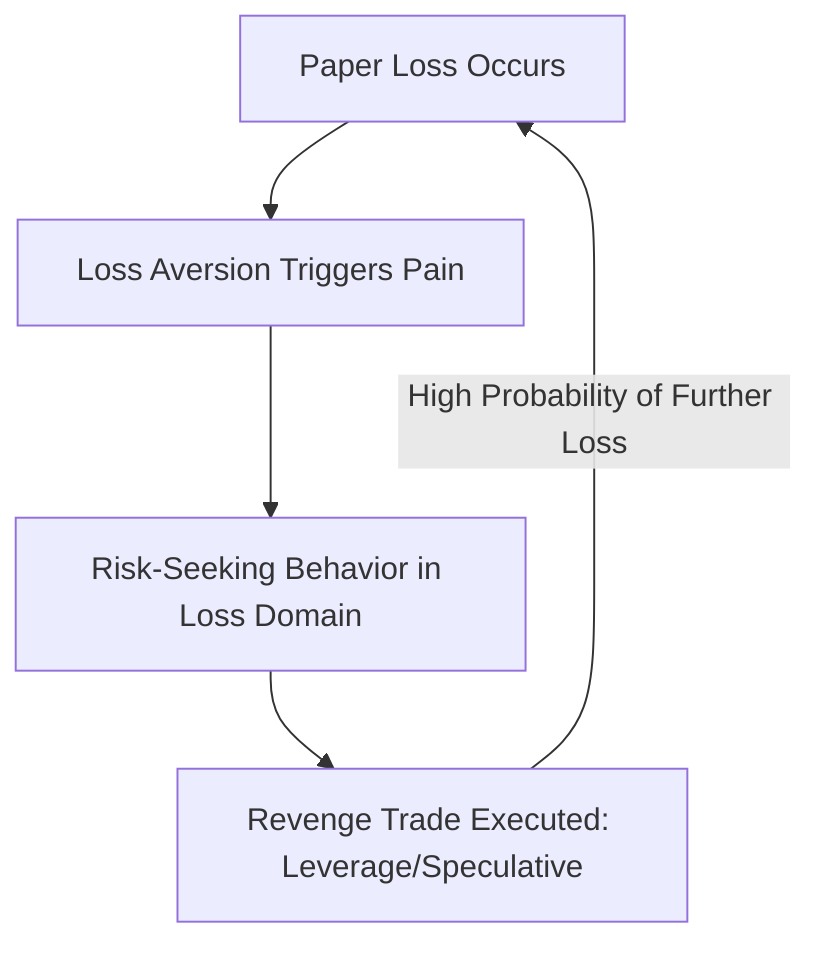

# Advanced Behavioral Finance Notes: Retail Investor Cognition & AI Intervention
## Mathematical and Psychological Frameworks of Retail Investing Behavior

### Author
**Rignesh P**

---

## 1. Introduction & Theoretical Context
Traditional finance operates on the **Rational Agent Hypothesis** (*Homo economicus*), which assumes that investors make optimal decisions under uncertainty by maximizing expected utility. However, empirical studies in behavioral economics demonstrate that human decision-making is systematically biased, particularly under conditions of uncertainty and market volatility. 

For teen and small retail investors, these psychological biases are amplified due to:
*   Limited historical market experience.
*   Highly gamified mobile trading interfaces.
*   The influence of decentralized digital information hubs (Reddit, TikTok, Discord, YouTube).

This document outlines the core behavioral biases targeted by the **AI Financial Risk Copilot** and details the cognitive models used to identify and mitigate them.

---

## 2. Mathematical Modeling of Core Biases

### 2.1 Loss Aversion & Prospect Theory
Formulated by Daniel Kahneman and Amos Tversky (1979), **Prospect Theory** replaces expected utility with a subjective value function $V(x)$. The function is defined relative to a reference point (e.g., initial purchase price):

$$V(x) = \begin{cases} x^\alpha & \text{if } x \ge 0 \\ -\lambda(-x)^\beta & \text{if } x < 0 \end{cases}$$

Where:
*   $x$ represents the financial gain or loss relative to the reference point.
*   $\alpha, \beta \approx 0.88$ model the diminishing sensitivity to gains and losses.
*   $\lambda \approx 2.25$ is the **Loss Aversion Coefficient**, indicating that a loss of $100 feels twice as painful as a gain of $100 feels pleasurable.

#### The Revenge Trading Loop
In retail investing, loss aversion frequently triggers the **Revenge Trading Loop**. When small investors face substantial paper losses, they exhibit risk-seeking behavior in the domain of losses. They attempt to recover the deficit immediately by:
1.  Opening highly leveraged positions (e.g., short-dated out-of-the-money options).
2.  "Doubling down" on declining speculative assets without structural valuation reviews.



 <p align="center">
   
 </p>

---

### 2.2 Herd Behavior & Social Proof
Herd behavior occurs when individual investors ignore their private information or fundamental analysis, choosing instead to replicate the collective actions of a larger group. In modern retail investing, this is driven by **digital social proof**:

$$P_{herd}(t) = f\left(\mathcal{S}_{media}(t), \, \text{Sentiment}_{forum}(t)\right)$$

Where:
*   $\mathcal{S}_{media}(t)$ represents the social media volume/velocity (e.g., number of active threads on Reddit WallStreetBets or viral videos on TikTok) at time $t$.
*   $\text{Sentiment}_{forum}(t)$ represents the aggregate speculative tone (bullish/bearish momentum indicators).

This herding mechanism leads to positive feedback loops, asset pricing bubbles (e.g., "meme stocks", speculative dog-themed cryptocurrencies), and severe subsequent crashes when the herd sentiment shifts.

---

### 2.3 Overconfidence & Self-Attribution Bias
Overconfidence leads retail investors to overestimate their financial literacy, predictive abilities, and risk tolerance. Barber and Odean (2001) demonstrated that overconfidence leads to excessive trading frequency, which systematically degrades net portfolio returns due to transaction costs, spreads, and high-beta exposure.

The AI Copilot defines **Overconfidence Bias** through two vectors:
1.  **Overestimation of Knowledge**: Believing a concentrated asset allocation is "risk-free" or "guaranteed".
2.  **Self-Attribution**: Attributing random positive market gains to trading skill, while blaming losses on external "market manipulation" or bad luck.

---

## 3. The Explainable AI (XAI) Nudge Framework
The AI Financial Risk Copilot does not act as an automated speculative trading bot. Instead, it utilizes **Choice Architecture** (Thaler & Sunstein, 2008) to nudge retail investors back toward safety.

```txt
Dry Disclaimer (Standard Robo)  ➔  Ignored ➔ High Impulsive Action
Empathetic Copilot Feedback      ➔  Reflected ➔ Cognitive Circuit-Breaker ➔ Safer Portfolio Rebalancing
```

### Cognitive Circuit-Breakers
When the Behavioral NLP Module scans high-urgency or revenge-trading phrases (e.g., *"I need to recover my losses quickly"*), the system activates a **Cognitive Circuit-Breaker**:
1.  **Reframing the Loss**: Validating the investor's emotional distress ("It is completely normal to feel anxious during a drop...").
2.  **Empathetic Translation**: Replacing cold standard deviations with clear, relatable analogies ("Checking your ticker every 5 seconds is like checking the weather forecast during a storm...").
3.  **Active Cooling-Off Recommendation**: Guiding the user to shut down the app, step away, and review their initial long-term strategy rather than executing immediate speculative trades.

By integrating these behavioral finance principles directly into the design of explainable AI interfaces, the framework actively works to protect small investors, raise financial literacy levels, and encourage healthier long-term investing habits.

---

## 4. References & Citations

1. **Kahneman, D., & Tversky, A. (1979).** Prospect Theory: An Analysis of Decision under Risk. *Econometrica*, 47(2), 263-291.
2. **Tversky, A., & Kahneman, D. (1991).** Loss Aversion in Riskless Choice: A Reference-Dependent Model. *The Quarterly Journal of Economics*, 106(4), 1039-1061.
3. **Tversky, A., & Kahneman, D. (1992).** Advances in Prospect Theory: Cumulative Representation of Uncertainty. *Journal of Risk and Uncertainty*, 5(4), 297-323.
4. **Benartzi, S., & Thaler, R. H. (1995).** Myopic Loss Aversion and the Equity Premium Puzzle. *The Quarterly Journal of Economics*, 110(1), 73-92.
5. **Shiller, R. J. (2003).** From Efficient Markets Theory to Behavioral Finance. *Journal of Economic Perspectives*, 17(1), 83-104.
6. **Barberis, N., & Thaler, R. (2003).** A Survey of Behavioral Finance. *Handbook of the Economics of Finance*, 1, 1053-1123.
7. **Thaler, R. H. (2015).** *Misbehaving: The Making of Behavioral Economics*. W. W. Norton & Company.
8. **Thaler, R. H., & Sunstein, C. R. (2008).** *Nudge: Improving Decisions About Health, Wealth, and Happiness*. Yale University Press.
9. **Barber, B. M., & Odean, T. (2000).** Trading Is Hazardous to Your Wealth: The Common Stock Investment Performance of Individual Investors. *The Journal of Finance*, 55(2), 773-806.
10. **Barber, B. M., & Odean, T. (2001).** Boys will be Boys: Gender, Overconfidence, and Common Stock Investment. *The Quarterly Journal of Economics*, 116(1), 261-292.
11. **Barber, B. M., & Odean, T. (2013).** The Behavior of Individual Investors. *Handbook of the Economics of Finance*, 2, 1533-1611.
12. **Lo, A. W., Repin, D. V., & Steenbarger, B. N. (2005).** Out of the Box: The Cognitive Neurosciences of Financial Decision Making. *Journal of Cognitive Neuroscience*, 17(8), 1300-1308.
13. **Shefrin, H., & Statman, M. (1985).** The Disposition to Sell Winners Too Early and Ride Losers Too Long: Theory and Evidence. *The Journal of Finance*, 40(3), 777-790.
14. **Daniel, K., Hirshleifer, D., & Subrahmanyam, A. (1998).** Investor Psychology and Security Market Under- and Overreactions. *The Journal of Finance*, 53(6), 1839-1885.
