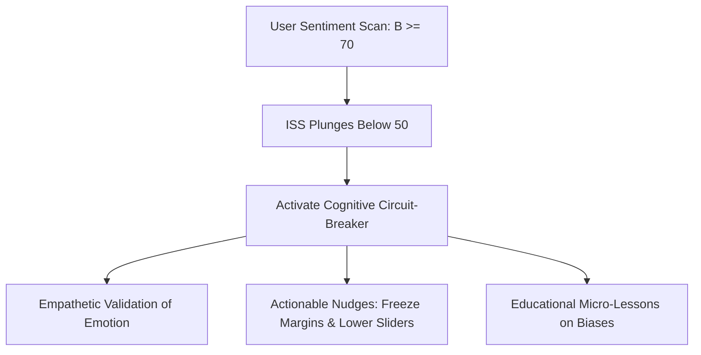

# NLP Emotional Risk Detection & Semantic Lexicons in Retail Investing
## Algorithmic Mappings of Conversational Sentiment to Cognitive Vulnerability Scores

### Author
**Rignesh P**

---

## 1. Abstract & Context
The **AI Financial Risk Copilot** introduces a **Behavioral Detection Layer** designed to monitor and classify qualitative user sentiment into quantifiable financial risk metrics. 

While quantitative engines track portfolio allocations, they cannot detect the underlying psychological intent driving transactions. If an investor is revenge trading after a major loss, or chasing hype due to digital social proof, their cognitive bias represents a severe systemic vulnerability. 

This paper documents the **Natural Language Processing (NLP)** dictionary matching lexicons, regex keyword vectors, and mathematical scaling formulations used to calculate the **Behavioral Risk Score ($\mathcal{B}$)** in our cognition framework.

---

## 2. Emotional Risk Categories & Lexicon Dictionaries

The framework evaluates four distinct cognitive biases using regex dictionary lexicons. If a user query matches keywords in these dictionaries, the system triggers active bias flags:

| Bias Category | Psychological Mechanics | Core Lexicon Triggers | Mapped Weight |
| :--- | :--- | :--- | :--- |
| **FOMO & Herd Behavior** | The urgent fear of missing speculative gains, leading to replicating digital trends. | `moon`, `rocket`, `trending`, `tiktok`, `hype`, `all savings`, `doge`, `crypto`, `bubble`, `double`, `fomo`, `chasing` | $\mathcal{B}_{fomo} = 60$ |
| **Loss Aversion / Revenge Trading** | The extreme psychological distress of paper losses leading to high-leverage risk-seeking. | `lost`, `panic`, `revenge`, `double down`, `get it back`, `down`, `options`, `crash`, `sell everything`, `losses`, `worried` | $\mathcal{B}_{loss} = 70$ |
| **Overconfidence Bias** | Overestimating one's knowledge and trading skills, believing markets are risk-free. | `guaranteed`, `can't lose`, `100%`, `sure`, `risk-free`, `easy money`, `masterclass`, `expert`, `predict` | $\mathcal{B}_{over} = 55$ |
| **Recency Bias** | Disproportionately weighting short-term past performance over long-term fundamentals. | `down for two days`, `up for three days`, `lately`, `recently`, `losing streak`, `winning streak` | $\mathcal{B}_{rec} = 50$ |

---

## 3. Algorithmic Parsing & Math Formulations

The Behavioral Detection Layer parses user statements through a sequential regex scanning pipeline. 

### 3.1 Step 1: Lexicon Matching Vectors
Let $T$ be the normalized, lower-cased user text input string. We define a binary matching vector $\mathbf{v} = [v_1, v_2, v_3, v_4]^T$ where:

$$v_k = \begin{cases} 1 & \text{if } T \text{ matches Lexicon } k \\ 0 & \text{otherwise} \end{cases}$$

### 3.2 Step 2: Risk Scoring Coefficient Calculation
Each active bias is mapped to its core score coefficient $\mu_k$. When a lexicon matches, the active score is computed. The overall **Behavioral Risk Score ($\mathcal{B}$)** is formulated as:

$$\mathcal{B} = \max \left( \mathcal{B}_{base}, \, \sum_{k=1}^{4} v_k \cdot \mu_k \right)$$

Where:
*   $\mathcal{B}_{base} = 25$ represents the baseline curiosity risk score for a rational investor.
*   The coefficients are $\mu_1 = 35$ (FOMO), $\mu_2 = 45$ (Loss/Revenge), $\mu_3 = 30$ (Overconfidence), and $\mu_4 = 25$ (Recency).
*   The final score is capped at $100$: $\mathcal{B} = \min(100, \, \mathcal{B})$.

---

## 4. Choice Architecture & Cognitive Circuit-Breaking

Once the Behavioral Risk Score ($\mathcal{B}$) is calculated, it directly influences the **Investor Safety Score ($ISS$)**. If $\mathcal{B} \ge 70$, the explainability engine activates the **Cognitive Circuit-Breaker**:

1.  **Reframing**: Rather than labeling the action as "wrong", the AI validates the emotional driver (e.g., *"Seeing your savings drop is incredibly painful..."*).
2.  **Visual Nudges**: The dashboard's **Radar Chart** morphs its polygon to stretch along the active bias axis, and the **Heatmap** cell glows red, creating a powerful visual warning.
3.  **Action Directives**: Suggesting an immediate cooling-off period (e.g., stepping away for 24 hours, resetting margins to 1.0x) to encourage a return to safe, diversified allocations.

By combining NLP-based psychological scans with quantitative risk engineering, the AI Financial Risk Copilot establishes a highly advanced, compassionate safety shield, fostering positive retail investing behaviors in volatile environments.

---

## 5. References & Citations

1. **Bollen, J., Mao, H., & Zeng, X. (2011).** Twitter Mood Predicts the Stock Market. *Journal of Computational Science*, 2(1), 1-8.
2. **Tetlock, P. C. (2007).** Giving Content to Investor Sentiment: The Role of Media in the Stock Market. *The Journal of Finance*, 62(3), 1139-1168.
3. **Lo, A. W., & Repin, D. V. (2002).** The Psychophysiology of Real-Time Financial Decision Making. *Cognitive Brain Research*, 14(3), 323-339.
4. **Pang, B., & Lee, L. (2008).** Opinion Mining and Sentiment Analysis. *Foundations and Trends in Information Retrieval*, 2(1–2), 1-135.
5. **Kahneman, D., & Tversky, A. (1979).** Prospect Theory: An Analysis of Decision under Risk. *Econometrica*, 47(2), 263-291.
6. **Barber, B. M., & Odean, T. (2001).** Boys will be Boys: Gender, Overconfidence, and Common Stock Investment. *The Quarterly Journal of Economics*, 116(1), 261-292.
