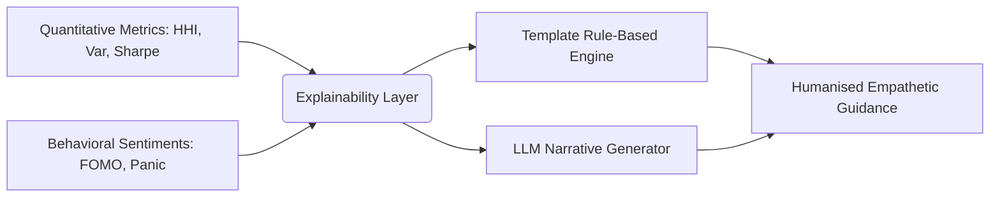

# Explainable AI in Retail Finance: Breaking the "Black Box" of Quantitative Analytics
## Frameworks for Empathetic Natural Language Generation and Contextual Risk Warnings

### Author
**Rignesh P**

---

## 1. The Challenge of Financial "Black Boxes"
In modern computational finance, machine learning models (e.g., deep neural networks, gradient boosting trees) are widely utilized to predict stock price direction, evaluate creditworthiness, and construct optimized portfolios. However, these systems operate as **black boxes**. They output highly accurate quantitative metrics (e.g., standard deviation, alpha, beta, tracking error) but fail to explain:
*   How these metrics are derived.
*   What these metrics mean in practical, everyday terms.
*   What actionable steps a retail investor should take to mitigate the associated risks.

For teen and small retail investors, this lack of transparency creates a **cognitive block**. An investor presented with a dry chart showing *"Beta: 1.8; Volatility: 45%"* is highly likely to ignore the warning entirely, leading to sub-optimal, high-risk financial behaviors.

The **AI Financial Risk Copilot** bridges this gap by introducing an **Empathetic Translation Layer (XAI)**, converting cold quantitative analytics into humanised, actionable advice.

---

## 2. Systemic Architecture of the Translation Layer

The explainability layer functions as a natural language generation (NLG) engine that sits directly on top of the quantitative risk scoring systems. 

### 2.1 The Math-to-Analogies Translation Engine
Rather than repeating standard investment disclaimers, the Copilot uses cognitive reframing to map mathematical parameters into real-world physical metaphors:

#### Example 1: Concentration Risk (HHI)
*   **Quantitative Input**: $HHI = 0.82$ (Critical concentration in a single meme stock).
*   **Standard Output**: *"Portfolio HHI exceeds threshold. Diversification is recommended."*
*   **Empathetic Analogy**: **"You have a lot riding on just one asset."** *"Placing all your savings in GME is like putting all your fragile glass eggs in one single basket. If that basket drops, every single egg breaks. Let's look at adding broad, steady baskets (like index funds) to cushion your capital."*

#### Example 2: Volatility Risk ($\sigma_p$)
*   **Quantitative Input**: $\sigma_p = 55\%$ (Annualized portfolio volatility).
*   **Standard Output**: *"Portfolio standard deviation: 0.55. High historical beta exposure."*
*   **Empathetic Analogy**: **"Your portfolio is on a rollercoaster."** *"The values of your investments are shifting rapidly. Swings of this size can feel thrilling on the way up, but they can be stomach-churning on the way down. Let's explore adding steady, low-swing broad market holdings to smooth out your financial ride."*

---

## 3. Adaptive Explanation Generation (AEG)
A key feature of the framework is **Adaptive Explanation Generation (AEG)**, which dynamically scales the vocabulary and complexity of financial advice based on the user's measured **Financial Literacy Score ($L$)**:

$$AEG(ISS, \, L) = \begin{cases} 
\text{Analogical \& Empathy Metaphors} & \text{if } L < 50 \text{ (Beginner)} \\
\text{Balanced Analogies + Core Metrics} & \text{if } 50 \le L < 80 \text{ (Intermediate)} \\
\text{Quantitative Mathematical Breakdowns} & \text{if } L \ge 80 \text{ (Advanced)} 
\end{cases}$$

### Efficacy of AEG
By adjusting the explanation density, the AI Risk Copilot:
1.  **Prevents Cognitive Overload** in beginners by using intuitive physical metaphors.
2.  **Improves Financial Literacy** by gradually introducing formal mathematical terms (e.g., standard deviation, correlation) alongside their real-world analogs.
3.  **Builds Structural Trust**, turning the AI into a supportive, conversational mentor rather than a cold algorithmic trading engine.

This explainable, human-centered framework demonstrates that AI can be applied responsibly in finance to foster healthy investing behaviors and safeguard retail participants in volatile markets.
