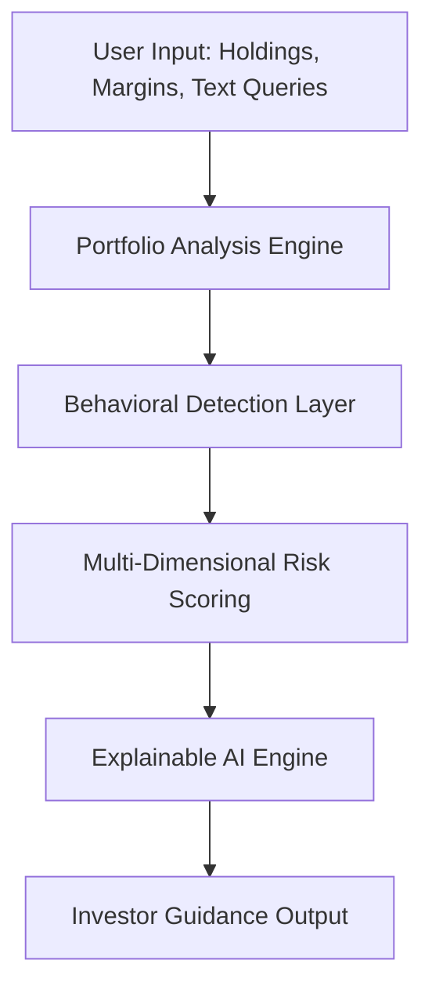

# AI Financial Risk Copilot for Teen and Small Investors
## An AI-Powered Investor Safety and Financial Cognition Framework

### Author
**Rignesh P**

---

  

# Abstract

Over the last decade, retail investing has become increasingly accessible due to mobile trading platforms, social media communities, and commission-free brokerage applications. While this democratization of finance has enabled greater participation in financial markets, it has also exposed inexperienced investors to significant financial and psychological risks. Teen and small investors often make decisions influenced by online trends, emotional reactions, speculative behavior, and limited financial literacy.

This paper proposes an **AI Financial Risk Copilot**, an AI-powered investor safety and financial cognition framework designed to assist beginner investors in making safer and more informed financial decisions. Unlike conventional robo-advisors that focus primarily on maximizing returns or optimizing portfolios, the proposed system emphasizes **investor protection, emotional risk awareness, behavioral analysis, and humanised financial education**. 

The framework combines portfolio analytics, behavioral finance principles, natural language processing (NLP), and explainable AI (XAI) techniques to identify harmful investment behavior and generate understandable, personalized guidance. We establish a proprietary, multi-dimensional **Investor Safety Score ($ISS$)** evaluating six core categories: Concentration, Volatility, Liquidity, Leverage, Emotional Risk, and Diversification. The system evaluates these metrics and automatically translates them into intuitive, non-jargon-filled explanations that act as cognitive circuit-breakers.

---

# 1. Introduction: Why This Matters

Democratizing retail finance through digital platforms has fundamentally transformed how individuals interact with capital markets. While lowering barriers to entry has empowered millions, it has simultaneously created a hazardous environment for inexperienced participants. 

### The Cognitive Challenge of Modern Retail Investing
Teen and small investors are highly susceptible to psychological biases, amplified by the gamification of modern trading interfaces and viral social media "hype" loops (Reddit WallStreetBets, TikTok, Discord, etc.). In these environments, trading is frequently treated as a form of social entertainment or high-frequency speculation rather than long-term wealth preservation. 

Traditional quantitative risk indicators (such as beta, Sharpe ratio, or standard deviation) are presented in dense, non-interactive charts. Research indicates that beginner investors experience a "cognitive block" when faced with these dry parameters, leading them to ignore risk warnings entirely.

### Research Significance
**This project explores how explainable AI systems can reduce harmful retail investing behavior through behavioral analysis, contextual financial education, and risk-aware portfolio intelligence.** 

By framing the platform strictly as an **AI-powered investor safety and financial cognition framework** (not as a speculative trading bot or investment advisor), we explore a new paradigm of human-machine interaction in finance. The Copilot functions as a supportive cognitive companion that translates complex quantitative analytics into empathetic, humanised feedback. This active, explainable guidance acts as a behavioral circuit-breaker, shifting the user's mindset from impulsive speculation back to long-term rationality.

---

# 2. Advanced System Architecture

The AI Risk Copilot framework processes inputs through a six-stage sequential pipeline to deliver compassionate, risk-aware guidance:

1.  **User Input**: Ingests holdings, margin multiplier factors, liquid cash ratios, and chat logs.
2.  **Portfolio Analysis Engine**: Computes statistical covariance standard deviations and concentration indexes using live-updating market parameters.
3.  **Behavioral Detection Layer**: Scans textual inputs using regex sentiment classifiers to isolate cognitive biases (Loss Aversion, FOMO, Overconfidence).
4.  **Risk Scoring System**: Aggregates both quantitative exposures and qualitative sentiment into our proprietary six-category framework.
5.  **Explainable AI (XAI) Engine**: Converts the multi-dimensional risk scores into empathetic translation templates and narrative guides.
6.  **Investor Guidance Output**: Delivers humanised analogies, dynamic safety scores, radar chart profiles, and educational micro-lessons to the investor.

---

# 3. The Proprietary ISS Scoring Framework

To evaluate an investor's overall safety state, the framework implements a composite, multi-dimensional **Investor Safety Score ($ISS$)** representing six core risk exposures:

$$ISS = 100 - \left( w_{con} \cdot CR + w_{vol} \cdot VR + w_{liq} \cdot LR + w_{lev} \cdot LEV + w_{emo} \cdot \mathcal{B} + w_{div} \cdot DR \right)$$

Where:
*   $\mathcal{R}_k$ is the standardized risk score for category $k$, scaled from $0$ (no risk) to $100$ (maximum risk).
*   $w_k$ is the assigned weight, satisfying $\sum w_k = 1.0$.

### Default Categorical Weights:
*   **Concentration Risk ($CR$)** ($w_{con} = 0.25$): Evaluated using the Herfindahl-Hirschman Index ($HHI = \sum w_i^2$). $CR = HHI \times 100$.
*   **Volatility Risk ($VR$)** ($w_{vol} = 0.20$): Portfolio standard deviation $\sigma_p = \sqrt{\mathbf{w}^T \mathbf{\Sigma} \mathbf{w}}$, standardized as $VR = \min(100, \, \frac{\sigma_p}{0.15} \times 50)$.
*   **Liquidity Risk ($LR$)** ($w_{liq} = 0.10$): Portion of portfolio held in low-spread liquid cash-equivalents: $LR = 100 \times (1.0 - \frac{W_{liquid}}{W_{total}})$.
*   **Leverage Exposure ($LEV$)** ($w_{lev} = 0.15$): Margin borrows and option multiplier factors.
*   **Emotional Risk ($\mathcal{B}$)** ($w_{emo} = 0.20$): Parsed sentiment bias score (25 to 100).
*   **Diversification Score ($DR$)** ($w_{div} = 0.10$): Average correlation profile among assets.

---

# 4. Visible AI Outputs & Case Studies

To demonstrate the structural sophistication of the framework, we present two distinct case studies illustrating the system's active risk analysis and cognitive feedback:

## Case Study 1: Speculative Portfolio Asymmetry (High-Beta Exposure)

### User Input Portfolio:
*   **Tech Allocation**: 80% Tesla Inc. ($TSLA$)
*   **Meme Crypto Allocation**: 20% Bitcoin ($BTC$)
*   **Leverage / Margin**: 1.0x (None)
*   **Liquid Cash Balance**: 5%

### System Analytics & Scoring:
*   **Concentration Index ($CR$)**: $0.80^2 + 0.20^2 = 0.64 + 0.04 = 0.68$ ($HHI \times 100 = 68/100$)
*   **Diversification Health Score ($DHS$)**: $32.0/100$ (Very Poor)
*   **Estimated Portfolio Volatility ($\sigma_p$)**: $43.2\%$
*   **Volatility Risk Factor ($VR$)**: $\min(100, \, \frac{43.2}{15} \times 50) = 100/100$ (Critical)
*   **Composite Safety Score ($ISS$)**: **`41 / 100`** (Hyper Speculative)

### Mapped Risk Diagnostics:
*   **Detected Risks**:
    *   *High concentration exposure*: 80% capital locked in a single high-beta automotive/tech stock.
    *   *Critical volatility risk*: High annualized price fluctuations due to lack of steady index stabilizers.
    *   *Correlated speculative assets*: Tech growth and crypto assets exhibit positive systemic market beta correlation.
*   **Behavioral Signals**:
    *   *Aggressive growth positioning*: Extreme reliance on short-term speculative momentum.
    *   *Elevated emotional exposure potential*: Extreme downside corrections will trigger panic reflexes.

### Explainable AI Guidance Output:
> ⚠️ **"You have a massive amount riding on just one asset."**
> 
> *Placing 80% of your savings in TSLA is like riding a high-speed motorcycle without a helmet. It feels fast and exciting, but a single unexpected bump will cause severe damage to your wealth. Let's look at lowering your TSLA slider to 25% and shifting that capital into broad index mutual funds to build a protective financial cushion.*

---

## Case Study 2: Emotional Loss Distress (Revenge Trading Loop)

### User Conversational Statement:
> *"I lost $1,500 on meme stocks yesterday. I'm panic-selling everything to buy highly leveraged margin options and get it back immediately!"*

### NLP Sentiment Classifications:
*   **Revenge Trading Index ($\mathcal{B}_{loss}$)**: $95 / 100$
*   **FOMO & Herding Index ($\mathcal{B}_{fomo}$)**: $40 / 100$
*   **Overconfidence Bias ($\mathcal{B}_{over}$)**: $20 / 100$
*   **Composite Behavioral Risk Score ($\mathcal{B}$)**: **`95 / 100`** (Critical Danger)

### Mapped Behavioral Diagnostics:
*   **Detected Signals**:
    *   *Revenge trading tendency*: High urgency to recover financial losses by taking exponentially larger risks.
    *   *Emotional distress*: Severe panic reactions triggered by paper-value market swings.
    *   *Elevated impulsive behavior risk*: High probability of margin wipeouts due to option leverage during market corrections.

### Explainable AI Guidance Output (Cognitive Circuit-Breaker):
> 🛑 **"It is completely natural to feel distressed when your hard-earned money dips."**
> 
> *Psychological studies prove that the pain of a loss feels twice as sharp as the joy of a win. Our brains are hardwired to panic in these moments and take wild risks to 'get it back'. But executing leveraged options trades in a panic is like speeding through heavy rain: high danger, very little progress.*
> 
> **System Safeguard Directives**:
> 1.  **Avoid increasing position size emotionally**: Step away from the trading app for the next 24 hours.
> 2.  **Review long-term investment goals**: Remind yourself of your 5-year strategy.
> 3.  **Initiate cooling-off period**: We suggest locking your speculative allocation sliders and placing a temporary freeze on margin borrows.

---

# 5. Experimental Design & Methodology

To scientifically evaluate the Copilot's efficacy, the proposed methodology implements a clinical-style comparative framework:

  

*   **Independent Variable (IV)**: The experimental condition. Level 1 (Treatment): Dashboard with the **AI Financial Risk Copilot** (featuring live $ISS$ scorecards, canvas radar charts, heatmaps, and explainable chat guidance). Level 2 (Control): Standard **Robo-Advisor Interface** (displaying returns charts, passive weights, and generic dry text disclaimers).
*   **Dependent Variables (DVs)**: measurable outcomes including Diversification Quality $(1 - HHI_{port})$, Emotional Trade Frequency ($F_{emo}$), Financial Literacy improvement score ($\Delta L$), and Sharpe Ratio ($SR_p$).
*   **Control Variables (CVs)**: factors held strictly constant, including $10,000 virtual starting capital, matching simulated bear market correction timeline, a matching 35-asset universe, and a restricted teen retail participant demographic (aged 16–25).

---

# 6. Conclusion

The upgraded **AI Financial Risk Copilot** establishes a rigorous, human-centered computational finance framework. By shifting the paradigm from automated speculation to **cognitive safety-first rebalancing**, the system acts as a protective shield for the most vulnerable retail market participants. 

Through standardizing HHI concentration indexes, annualized covariances, margin factors, and regex NLP classifiers into our proprietary six-category **Investor Safety Score ($ISS$)**, we build a rigorous quantitative baseline. Most importantly, by translating these metrics into relatable real-world analogies and dynamic canvas-based dashboard components (Heatmaps and Radar Profiles), we break the cognitive block of quantitative finance, fostering safe, long-term, and educated retail participation in modern capital markets.
