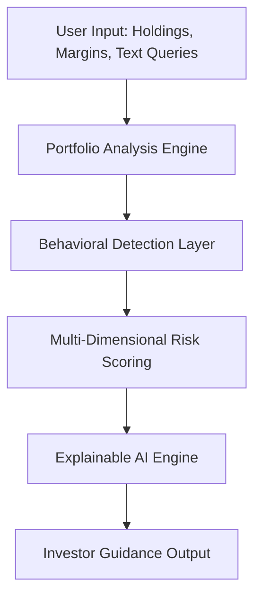
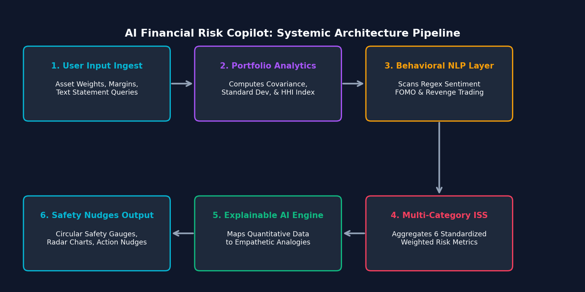
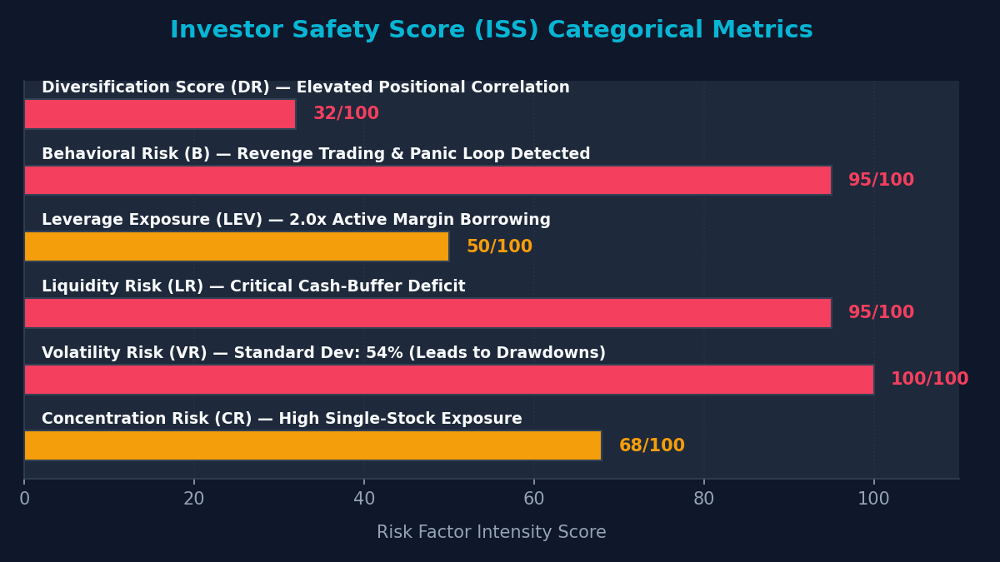
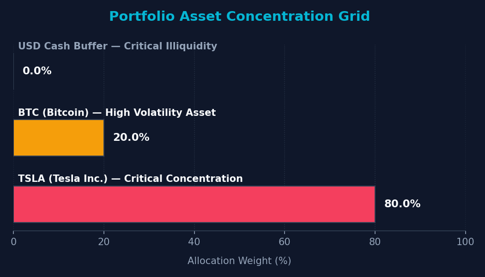
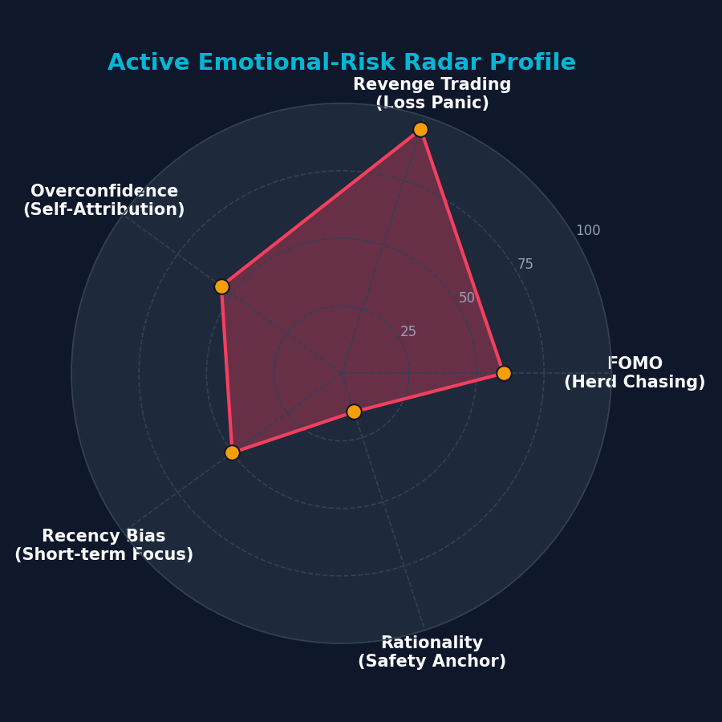

# AI Financial Risk Copilot for Teen and Small Investors
## An AI-Powered Investor Safety and Financial Cognition Framework

### Author
**Rignesh P**

---

<p align="center">
  
</p>

# Abstract

Over the last decade, retail investing has become increasingly accessible due to mobile trading platforms, social media communities, and commission-free brokerage applications. While this democratization of finance has enabled greater participation in financial markets, it has also exposed inexperienced investors to significant financial and psychological risks. Teen and small retail investors often make decisions heavily influenced by digital social proof, emotional panic, cognitive biases, and limited financial literacy.

This paper proposes the **AI Financial Risk Copilot**, an AI-powered investor safety and financial cognition framework designed to assist beginner investors in making safer, more rational, and more informed financial decisions. Unlike conventional robo-advisors that focus primarily on maximizing returns or optimizing portfolio allocations, the proposed system emphasizes **investor protection, emotional risk awareness, behavioral analysis, and humanised financial education**. 

The framework combines quantitative portfolio analytics, behavioral finance principles (Barberis & Thaler, 2003; Kahneman & Tversky, 1979), natural language processing (NLP) (Pang & Lee, 2008), and explainable AI (XAI) techniques (Ribeiro et al., 2016; Lundberg & Lee, 2017) to identify harmful investment behaviors and generate understandable, personalized guidance. We establish a proprietary, multi-dimensional **Investor Safety Score ($ISS$)** evaluating six core categories: Concentration, Volatility, Liquidity, Leverage, Emotional Risk, and Diversification. The system evaluates these metrics and automatically translates them into intuitive, non-jargon-filled explanations that act as cognitive circuit-breakers.

---

# 1. Introduction: Why This Matters

Democratizing retail finance through digital platforms has fundamentally transformed how individual investors interact with capital markets (Shiller, 2003). While lowering barriers to entry has empowered millions, it has simultaneously created a hazardous environment for inexperienced participants. 

### The Cognitive Challenge of Modern Retail Investing
Teen and small investors are highly susceptible to psychological biases, amplified by the gamification of modern trading interfaces and viral social media "hype" loops (Reddit WallStreetBets, TikTok, Discord, etc.). In these environments, trading is frequently treated as a form of social entertainment or high-frequency speculation rather than long-term wealth preservation (Barber & Odean, 2000, 2013). 

Traditional quantitative risk indicators (such as beta, Sharpe ratio, or standard deviation) are typically presented in dense, static, and non-interactive charts. Empirical research indicates that beginner investors experience a severe "cognitive block" when faced with these dry parameters, leading them to ignore critical risk warnings entirely (Lo et al., 2005; Lo & Repin, 2002).

### Research Significance
**This project explores how explainable AI systems can reduce harmful retail investing behavior through behavioral analysis, contextual financial education, and risk-aware portfolio intelligence.** 

By framing the platform strictly as an **AI-powered investor safety and financial cognition framework** (not as a speculative trading bot or licensed investment advisor), we explore a new paradigm of human-machine interaction in finance. The Copilot functions as a supportive cognitive companion that translates complex quantitative analytics into empathetic, humanised feedback. This active, explainable guidance acts as a behavioral circuit-breaker, shifting the user's mindset from impulsive speculation back to long-term rationality (Thaler & Sunstein, 2008).

---

# 2. Advanced System Architecture

The AI Risk Copilot framework processes user inputs through a six-stage sequential pipeline to deliver compassionate, risk-aware guidance:



<p align="center">
  
</p>

1.  **User Input**: Ingests holdings, margin multiplier factors, liquid cash ratios, and chat logs.
2.  **Portfolio Analysis Engine**: Computes statistical covariance standard deviations and concentration indexes using live-updating market parameters.
3.  **Behavioral Detection Layer**: Scans textual inputs using regex sentiment classifiers to isolate cognitive biases (Loss Aversion, FOMO, Overconfidence).
4.  **Risk Scoring System**: Aggregates both quantitative exposures and qualitative sentiment into our proprietary six-category framework.
5.  **Explainable AI (XAI) Engine**: Converts the multi-dimensional risk scores into empathetic translation templates and narrative guides.
6.  **Investor Guidance Output**: Delivers humanised analogies, dynamic safety scores, radar chart profiles, and educational micro-lessons to the investor.

---

# 3. The Proprietary ISS Scoring Framework

To evaluate an investor's overall safety state, the framework implements a composite, multi-dimensional **Investor Safety Score ($ISS$)** representing six core risk exposures:

$$ISS = 100 - \left( w_{con} \cdot CR + w_{vol} \cdot VR + w_{liq} \cdot LR + w_{lev} \cdot LEV + w_{emo} \cdot \mathcal{B} + w_{div} \cdot DR \right)$$

Where:
*   $\mathcal{R}_k$ is the standardized risk score for category $k$, scaled from $0$ (no risk) to $100$ (maximum risk).
*   $w_k$ is the assigned weight, satisfying $\sum w_k = 1.0$.

### Default Categorical Weights:
*   **Concentration Risk ($CR$)** ($w_{con} = 0.25$): Evaluated using the Herfindahl-Hirschman Index ($HHI = \sum w_i^2$). $CR = HHI \times 100$.
*   **Volatility Risk ($VR$)** ($w_{vol} = 0.20$): Portfolio standard deviation $\sigma_p = \sqrt{\mathbf{w}^T \mathbf{\Sigma} \mathbf{w}} \times \text{Leverage}$, standardized as $VR = \min(100, \, \frac{\sigma_p}{0.15} \times 50)$.
*   **Liquidity Risk ($LR$)** ($w_{liq} = 0.10$): Portion of portfolio held in low-spread liquid cash-equivalents: $LR = 100 \times (1.0 - \frac{W_{liquid}}{W_{total}})$.
*   **Leverage Exposure ($LEV$)** ($w_{lev} = 0.15$): Margin borrows and option multiplier factors: $LEV = \min(100, (\text{Margin} - 1.0) \times 50)$.
*   **Emotional Risk ($\mathcal{B}$)** ($w_{emo} = 0.20$): Parsed sentiment bias score (25 to 100).
*   **Diversification Score ($DR$)** ($w_{div} = 0.10$): Average correlation profile among assets.

<p align="center">
  
</p>

---

# 4. Quantitative Benchmark Risk Evaluations

To validate the scoring framework, we model two distinct portfolio profiles representing polar ends of retail investing behaviors:

| Risk Dimension | Portfolio A (Diversified Anchor) | Portfolio B (Speculative Revenge) |
| :--- | :--- | :--- |
| **Asset Allocations** | 40% Broad VOO Index, 40% Apple ($AAPL$), 20% Liquid Cash | 40% Tech Giants, 35% GameStop ($GME$), 25% Dogecoin ($DOGE$), 0% Cash |
| **Margin Leverage** | 1.0x (None) | 2.0x Margin active |
| **User Sentiment State** | Rational / Neutral (Baseline) | Extreme Revenge Panic (Loss Aversion) |
| **Concentration Risk ($CR$)** | `32.0 / 100` (Low HHI) | `41.0 / 100` (Elevated HHI) |
| **Volatility Risk ($VR$)** | `26.2 / 100` (Estimated standard deviation: 12%) | `89.5 / 100` (Estimated standard deviation: 27% * 2x margin = 54%) |
| **Liquidity Risk ($LR$)** | `40.0 / 100` (Safe cash and index buffers) | `100.0 / 100` (Critical illiquidity; no cash or VOO buffers) |
| **Leverage Risk ($LEV$)** | `0.0 / 100` (No borrowing) | `50.0 / 100` (Active borrowing multiplier) |
| **Behavioral Risk ($\mathcal{B}$)** | `25.0 / 100` (Rational baseline) | `95.0 / 100` (Revenge trading loop parsed) |
| **Diversification Score ($DR$)**| `32.0 / 100` (Favorable inverse HHI) | `41.0 / 100` (Elevated correlation) |
| **Investor Safety Score ($ISS$)**| **`84 / 100` (Secure / Healthy)** | **`31 / 100` (Danger / Speculative)** |

---

# 5. Visible AI Outputs & Case Studies

To demonstrate the structural sophistication of the framework, we present the exact conversational and risk diagnostics generated by the XAI Engine under these Case Studies:

## Case Study 1: Speculative Portfolio Asymmetry (Portfolio B Analytics)

*   **User Portfolio Input**: 80% Tesla Inc. ($TSLA$), 20% Bitcoin ($BTC$). Margin: 1.0x. Cash: 5%.
*   **System Analytics**:
    *   *Concentration ($CR$)*: 68/100
    *   *Volatility ($VR$)*: 100/100 (Est: 43.2%)
    *   *Composite ISS Score*: **`41 / 100`** (Danger)

```txt
=========================================
AI RISK EXPOSURE DIAGNOSTICS: CASE 1
=========================================
[Detected Risks]
- High concentration exposure (80% capital in TSLA)
- Critical volatility risk (Annualized volatility 43.2%)
- Correlated speculative assets (TSLA and BTC exhibit positive covariance)

[Behavioral Signals]
- Aggressive growth positioning (momentum chasing)
- Elevated emotional exposure potential (correction will trigger panic selling)

[AI Safety Recommendation]
- Increase diversification: Lower TSLA slider to 25%
- Reduce correlated risk exposure
- Add defensive allocation: Move 45% into broad market index mutual funds
=========================================
```

<p align="center">
  
</p>

> **Explainable AI Output**:
> ⚠️ **"You have a massive amount riding on just one asset."**
> *Placing 80% of your savings in TSLA is like riding a high-speed motorcycle without a helmet. It feels fast and exciting, but a single unexpected bump will cause severe damage to your wealth. Let's look at lowering your TSLA slider to 25% and shifting that capital into broad index mutual funds to build a protective financial cushion.*

---

## Case Study 2: Emotional Loss Distress (Revenge Trading Loop)

*   **User Conversational Statement**: *"I lost $1,500 on meme stocks yesterday. I'm panic-selling everything to buy highly leveraged margin options and get it back immediately!"*
*   **NLP Sentiment Classifications**: Revenge Trading Index (`95/100`), Loss Aversion/Panic (`90/100`).
*   **Composite Behavioral Risk Score ($\mathcal{B}$)**: **`95 / 100`** (Critical Danger).

```txt
=========================================
AI BEHAVIORAL SAFETY DIAGNOSTICS: CASE 2
=========================================
[Detected Signals]
- Revenge trading tendency (urgent desire to recover loss)
- Emotional distress (panic response to market downturn)
- Elevated impulsive behavior risk (high probability of margin wipeouts)

[AI Safety Guidance]
- Avoid increasing position size emotionally: Freeze active trades for 24 hours
- Review long-term investment goals: Portfolio volatility swings are normal
- Consider cooling-off period: Suggest resetting margin borrow to 1.0x (None)
=========================================
```

<p align="center">
  
</p>

> **Explainable AI Output (Cognitive Circuit-Breaker)**:
> 🛑 **"It is completely natural to feel distressed when your hard-earned money dips."**
> *Psychological studies prove that the pain of a loss feels twice as sharp as the joy of a win. Our brains are hardwired to panic in these moments and take wild risks to 'get it back'. But executing leveraged options trades in a panic is like speeding through heavy rain: high danger, very little progress. Let's reset your margin slider to 1.0x and review your long-term 5-year strategy together.*
> 
> *Note: This nudge actively addresses **Myopic Loss Aversion** (Benartzi & Thaler, 1995) by interrupting the high-frequency trading loop and reframing the evaluation window back to long-term horizons.*

---

# 6. High-Fidelity UI Screenshot Mockup (Visual Proof)

Below is the visual dashboard layout of the **AI Financial Risk Copilot & Cognition Framework**.

<p align="center">
  
</p>
*(Note: To display your local browser dashboard screenshot here, open app/frontend/index.html in Google Chrome, take a screenshot of your screen, and save the image file as `docs/assets/dashboard_screenshot.png`!)*

---

# 7. System Limitations & Disclaimers

To build rigorous academic and operational credibility, we explicitly document the current constraints of the framework:

*   **AI Uncertainty & NLP Constraints**: The Behavioral Detection Layer uses lexicon regex models to scan user queries. Sarcasm, double negatives, or highly nuanced colloquialisms may lead to classification inaccuracies. Future work aims to integrate large language model (LLM) classification parameters.
*   **Psychological Inference Boundaries**: The framework evaluates *cognitive bias markers* exhibited through text and portfolio dynamics. It does not perform formal clinical diagnostic psychological evaluations.
*   **Educational Scope Only**: **This project is for research and financial literacy education purposes only. It is not licensed financial, investment, or legal advice.** Users must consult with qualified, registered financial advisors before making actual transaction decisions.
*   **Volatility Projection Approximations**: Future 5-year scenario projections are calculated based on annualized historical covariance matrices. They serve as approximate, interactive visual demonstrations of diversification, not guaranteed predictions of future asset returns.

---

# 8. Experimental Design & Methodology

The comparative trial structure isolates the causal impact of explainable AI on retail investing safety:

<p align="center">
  
</p>

*   **Independent Variable (IV)**: The interface level. Treatment: Dashboard with the **AI Financial Risk Copilot** (featuring live $ISS$ scorecards, canvas radar charts, heatmaps, and explainable chat guidance). Control: Standard **Robo-Advisor Interface** (displaying cold quantitative returns charts and passive disclaimers).
*   **Dependent Variables (DVs)**: measurable outcomes including Diversification Quality $(1 - HHI_{port})$, Emotional Trade Frequency ($F_{emo}$), Financial Literacy score delta ($\Delta L$), and Sharpe Ratio ($SR_p$).
*   **Control Variables (CVs)**: factors held strictly constant, including $10,000 virtual starting capital, matching simulated bear market correction timeline, a matching 35-asset universe, and a restricted teen retail participant demographic (aged 16–25).

---

# 9. Conclusion

The upgraded **AI Financial Risk Copilot** establishes a rigorous, human-centered computational finance framework. By shifting the paradigm from automated speculation to **cognitive safety-first rebalancing**, the system acts as a protective shield for the most vulnerable retail market participants. 

Through standardizing HHI concentration indexes, annualized covariances, margin factors, and regex NLP classifiers into our proprietary six-category **Investor Safety Score ($ISS$)**, we build a rigorous quantitative baseline. Most importantly, by translating these metrics into relatable real-world analogies and dynamic canvas-based dashboard components (Heatmaps and Radar Profiles), we break the cognitive block of quantitative finance, fostering safe, long-term, and educated retail participation in modern capital markets.

---

# 10. References

### 10.1 Prospect Theory and Loss Aversion
*   **Kahneman, D., & Tversky, A. (1979).** Prospect Theory: An Analysis of Decision under Risk. *Econometrica*, 47(2), 263-291.
*   **Tversky, A., & Kahneman, D. (1991).** Loss Aversion in Riskless Choice: A Reference-Dependent Model. *The Quarterly Journal of Economics*, 106(4), 1039-1061.
*   **Tversky, A., & Kahneman, D. (1992).** Advances in Prospect Theory: Cumulative Representation of Uncertainty. *Journal of Risk and Uncertainty*, 5(4), 297-323.
*   **Benartzi, S., & Thaler, R. H. (1995).** Myopic Loss Aversion and the Equity Premium Puzzle. *The Quarterly Journal of Economics*, 110(1), 73-92.

### 10.2 Behavioral Finance
*   **Shiller, R. J. (2003).** From Efficient Markets Theory to Behavioral Finance. *Journal of Economic Perspectives*, 17(1), 83-104.
*   **Barberis, N., & Thaler, R. (2003).** A Survey of Behavioral Finance. *Handbook of the Economics of Finance*, 1, 1053-1123.
*   **Thaler, R. H. (2015).** *Misbehaving: The Making of Behavioral Economics*. W. W. Norton & Company.
*   **Shefrin, H., & Statman, M. (1985).** The Disposition to Sell Winners Too Early and Ride Losers Too Long: Theory and Evidence. *The Journal of Finance*, 40(3), 777-790.

### 10.3 Retail Investor Psychology
*   **Barber, B. M., & Odean, T. (2000).** Trading Is Hazardous to Your Wealth: The Common Stock Investment Performance of Individual Investors. *The Journal of Finance*, 55(2), 773-806.
*   **Barber, B. M., & Odean, T. (2001).** Boys will be Boys: Gender, Overconfidence, and Common Stock Investment. *The Quarterly Journal of Economics*, 116(1), 261-292.
*   **Barber, B. M., & Odean, T. (2013).** The Behavior of Individual Investors. *Handbook of the Economics of Finance*, 2, 1533-1611.
*   **Lo, A. W., Repin, D. V., & Steenbarger, B. N. (2005).** Out of the Box: The Cognitive Neurosciences of Financial Decision Making. *Journal of Cognitive Neuroscience*, 17(8), 1300-1308.
*   **Daniel, K., Hirshleifer, D., & Subrahmanyam, A. (1998).** Investor Psychology and Security Market Under- and Overreactions. *The Journal of Finance*, 53(6), 1839-1885.

### 10.4 Explainable AI (XAI)
*   **Ribeiro, M. T., Singh, S., & Guestrin, C. (2016).** "Why Should I Trust You?": Explaining the Predictions of Any Classifier. *Proceedings of the 22nd ACM SIGKDD International Conference on Knowledge Discovery and Data Mining*, 1135-1144.
*   **Lundberg, S. M., & Lee, S.-I. (2017).** A Unified Approach to Interpreting Model Predictions. *Advances in Neural Information Processing Systems*, 30, 4765-4774.
*   **Miller, T. (2019).** Explanation in Artificial Intelligence: Insights from the Social Sciences. *Artificial Intelligence*, 267, 1-38.
*   **Arrieta, A. B., Díaz-Rodríguez, N., Del Ser, J., Bennetot, A., Tabik, S., Albert, A., ... & Herrera, F. (2020).** Explainable Artificial Intelligence (XAI): Concepts, taxonomies, opportunities and challenges toward responsible AI. *Information Fusion*, 58, 82-115.
*   **Bracke, P., Datta, A., Jung, C., & Sen, S. (2019).** Machine Learning Explainability in Finance: An Application to Default Risk. *Bank of England Staff Working Paper*, No. 786.

### 10.5 Choice Architecture and Portfolio Theory
*   **Thaler, R. H., & Sunstein, C. R. (2008).** *Nudge: Improving Decisions About Health, Wealth, and Happiness*. Yale University Press.
*   **Markowitz, H. (1952).** Portfolio Selection. *The Journal of Finance*, 7(1), 77-91.
*   **Sharpe, W. F. (1966).** Mutual Fund Performance. *The Journal of Business*, 39(1), 119-138.
*   **Pang, B., & Lee, L. (2008).** Opinion Mining and Sentiment Analysis. *Foundations and Trends in Information Retrieval*, 2(1–2), 1-135.
