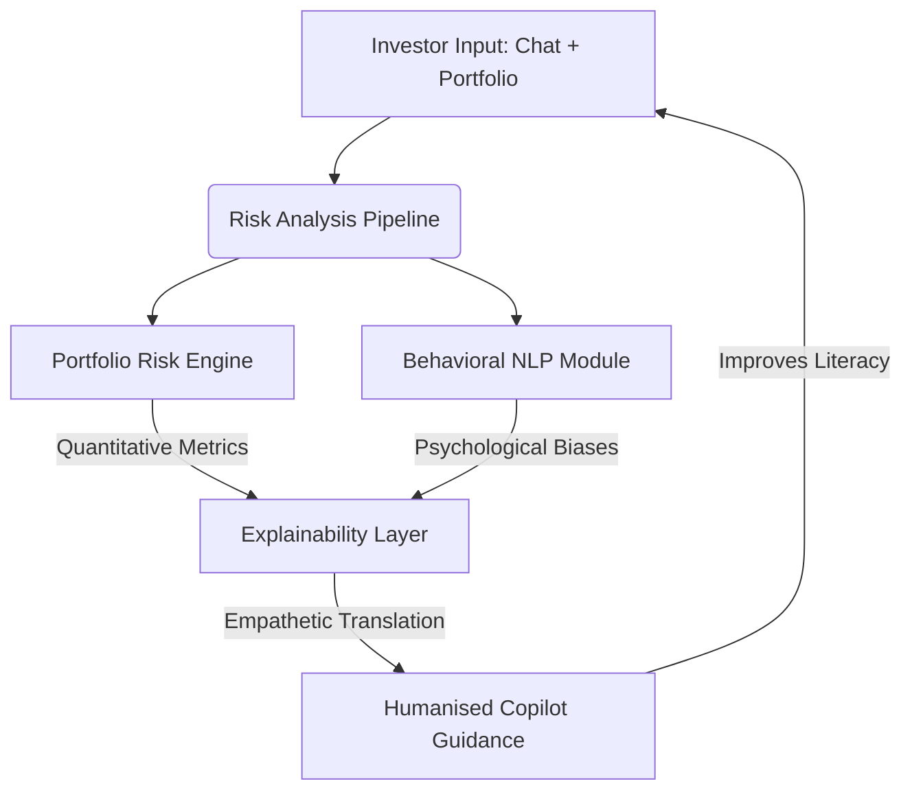
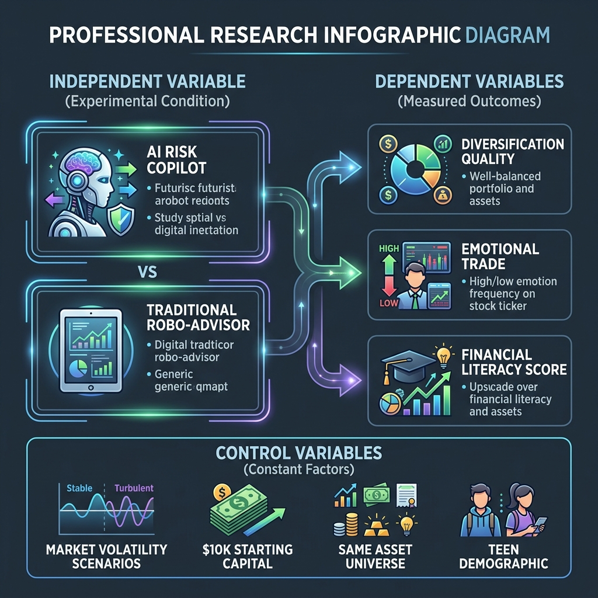

# AI Financial Risk Copilot for Teen and Small Investors
## A Human-Centered Explainable AI Framework for Safer Retail Investing

### Author
**Rignesh P**

---

  

# Abstract

Over the last decade, retail investing has become increasingly accessible due to mobile trading platforms, social media communities, and commission-free brokerage applications. While this democratization of finance has enabled greater participation in financial markets, it has also exposed inexperienced investors to significant financial and psychological risks. Teen and small investors often make decisions influenced by online trends, emotional reactions, speculative behavior, and limited financial literacy.

This paper proposes an **AI Financial Risk Copilot**, a human-centered explainable artificial intelligence (XAI) system designed to assist beginner investors in making safer and more informed financial decisions. Unlike conventional robo-advisors that focus primarily on maximizing returns or optimizing portfolios, the proposed system emphasizes **investor protection, emotional risk awareness, behavioral analysis, and humanized financial education**. 

The framework combines portfolio analytics, behavioral finance principles, natural language processing (NLP), and explainable AI techniques to identify harmful investment behavior and generate understandable, personalized guidance. We formally define an experimental framework incorporating **Independent Variables (IV)**, **Control Variables (CV)**, and **Dependent Variables (DV)** to evaluate the system's efficacy. The system evaluates diversification (via the Herfindahl-Hirschman Index), volatility exposure, emotional investing patterns, and concentration risk, translating these quantitative metrics into intuitive, non-jargon-filled explanations.

---

# 1. Introduction

Financial markets have undergone a significant transformation with the rise of digital investing platforms and social-media-driven investing culture. Applications such as Robinhood and Webull, along with online communities on Reddit, TikTok, YouTube, and Discord, have enabled millions of individuals to participate in investing with minimal barriers.

Although increased accessibility has democratized investing opportunities, it has simultaneously introduced new risks for inexperienced participants. Many beginner investors enter financial markets without a foundational understanding of portfolio management, diversification, or risk-adjusted investing principles. As a result, investment decisions are frequently influenced by emotion, peer pressure, internet trends, and the Fear of Missing Out (FOMO).

Behavioral finance research demonstrates that investors often act irrationally under uncertainty. Emotional responses such as panic during market downturns or overconfidence during bull markets can lead to harmful financial decisions. Young investors are particularly vulnerable due to limited experience, high susceptibility to social proof, and lack of humanized financial education. 

Existing robo-advisory systems primarily focus on algorithmic portfolio optimization and automated allocation strategies. However, most platforms provide limited behavioral analysis and insufficient explanation of financial risks for beginner users. Many systems produce automated trading signals without helping users understand *why* certain actions may be highly risky or how their emotional state is driving their decision-making.

This research introduces the concept of an **AI Financial Risk Copilot**, a system designed not to maximize speculative gains, but rather to improve financial decision-making safety, explain investment risks clearly, "humanise" complex statistical formulations, and encourage healthy long-term investing behavior.

---

# 2. Problem Statement

The rapid growth of retail investing has created an environment where inexperienced investors can access highly volatile financial products without adequate financial guidance. Teen and small investors commonly face the following challenges:

*   **Limited Financial Literacy**: Many new investors lack an intuitive understanding of diversification, market volatility, long-term compounding, and risk-adjusted returns.
*   **Emotional and Impulsive Investing**: Investment decisions are frequently driven by psychological biases, including panic selling during market drawdowns, chasing trending assets ("hype stocks"), attempting to recover losses quickly ("revenge trading"), and following social-media-driven speculation.
*   **Overconcentration Risk**: Beginner investors often allocate a disproportionate percentage of their portfolio into a single stock, cryptocurrency, or speculative asset, exposing them to catastrophic losses.
*   **Lack of Explainability and Empathy in Financial AI**: Traditional algorithmic financial models operate as "black boxes," delivering cold technical metrics (e.g., "portfolio beta is 1.8") without explaining what these terms mean in practical, human terms.

---

# 3. Research Objectives

The core objectives of this research are:
1.  **To design a human-centered AI assistant** tailored to the unique behavioral profiles of teen and beginner retail investors.
2.  **To develop behavioral NLP classifiers** capable of identifying emotional biases and impulsive intent in user conversations.
3.  **To formulate a composite Investor Safety Score ($ISS$)** that merges quantitative portfolio metrics with qualitative behavioral factors.
4.  **To "humanise" financial analytics** by automatically converting complex mathematical risk metrics into empathetic, accessible narrative guides.
5.  **To establish a rigorous experimental methodology** evaluating the impact of the Copilot on retail investor safety.

---

# 4. Literature Review

## 4.1 Behavioral Finance and Psychological Biases
Traditional economic theory (e.g., the Efficient Market Hypothesis) assumes that market participants behave as rational agents (*Homo economicus*). However, pioneer research by Daniel Kahneman and Amos Tversky (1979) in **Prospect Theory** demonstrated that humans exhibit systemic cognitive biases under uncertainty. Prospect theory highlights *loss aversion*, showing that the psychological pain of a financial loss is approximately twice as intense as the pleasure of an equivalent gain:

$$V(x) = \begin{cases} x^\alpha & x \ge 0 \\ -\lambda(-x)^\beta & x < 0 \end{cases}$$

Where $\lambda > 1$ represents the loss aversion coefficient (empirically found to be $\approx 2.25$). 

Additional psychological biases relevant to young retail investors include:
*   **Herd Behavior**: Imitating the collective actions of a larger group, particularly driven by social media trends ("meme stocks"), ignoring underlying asset valuations.
*   **Overconfidence Bias**: Overestimating one's knowledge, trading frequency, and predictive ability, often leading to excessive transaction costs and concentrated portfolios (Barber & Odean, 2001).
*   **Recency Bias**: Overweighting recent market events (e.g., a massive 3-day rally in a cryptocurrency) while ignoring long-term historical performance and downside risks.

## 4.2 Portfolio Optimization and Robo-Advisors
Modern Portfolio Theory (MPT), formulated by Harry Markowitz (1952), establishes that an investor can construct an "efficient frontier" of optimal portfolios offering the maximum possible expected return for a given level of risk. MPT relies heavily on diversification to reduce idiosyncratic (unsystematic) risk.

While automated robo-advisors utilize MPT algorithms to balance allocations, they typically fail to address the behavioral side of investing. If an emotional investor decides to bypass the automated allocation to buy a high-risk speculative asset, standard platforms offer little more than standard dry legal disclaimers. The AI Financial Risk Copilot bridges this gap by acting as an active, empathetic behavioral counterweight.

## 4.3 Explainable Artificial Intelligence (XAI)
Explainable AI aims to make machine learning models transparent, interpretable, and trustworthy. Popular XAI techniques, such as LIME (Ribeiro et al., 2016) and SHAP, decompose complex model predictions into individual feature contributions. In retail finance, explainability must go beyond feature weights; it must translate technical statistics into clear, relatable stories. The AI Copilot incorporates natural language generation (NLG) to create a humanised translation layer over complex financial models.

---

# 5. Proposed Framework

The proposed framework represents a shift from *returns-maximization algorithms* to a *safety-first behavioral feedback loop*. 

The system acts as a protective shield, continuously monitoring active portfolios and conversational statements to detect high-risk states, generating supportive explanations that guide the investor back to safety.

---

# 6. Statistical Metrics & Mathematical Formulations

To ensure mathematical and statistical rigor, the AI Financial Risk Copilot implements four core statistical metrics:

### 6.1 Portfolio Diversification Index (Herfindahl-Hirschman Index)
To measure concentration risk, the system utilizes the Herfindahl-Hirschman Index ($HHI$), historically applied in antitrust law but adapted here to represent portfolio concentration:

$$HHI = \sum_{i=1}^{N} w_i^2$$

Where:
*   $N$ is the total number of assets in the portfolio.
*   $w_i$ is the portfolio weight of asset $i$ (such that $\sum w_i = 1.0$).

The $HHI$ ranges from $\frac{1}{N}$ (perfectly equal distribution across $N$ assets) to $1.0$ (complete concentration in a single asset). 
To make this intuitive for retail investors, we define the **Diversification Health Score ($DHS$)**:

$$DHS = (1 - HHI) \times 100$$

*   **Aesthetic Metric Range**:
    *   $DHS \ge 75$: **High Diversification** (Healthy, well-balanced portfolio)
    *   $50 \le DHS < 75$: **Moderate Diversification** (Elevated sector/concentration risk)
    *   $DHS < 50$: **Poor Diversification** (Dangerous concentration; "all eggs in too few baskets")

### 6.2 Portfolio Volatility ($\sigma_p$)
Portfolio volatility represents the historical price fluctuations of the investor's assets, incorporating both individual asset variances and their correlations:

$$\sigma_p = \sqrt{\mathbf{w}^T \mathbf{\Sigma} \mathbf{w}} = \sqrt{\sum_{i=1}^N \sum_{j=1}^N w_i w_j \sigma_{ij}}$$

Where:
*   $\mathbf{w}$ is the vector of portfolio weights.
*   $\mathbf{\Sigma}$ is the asset covariance matrix, where $\sigma_{ij}$ is the covariance between asset $i$ and asset $j$.

To standardise this metric for beginners, the system computes the **Volatility Risk Factor ($VRF$)** relative to a historical S&P 500 benchmark volatility ($\sigma_{SPY} \approx 15\%$ annualized):

$$VRF = \min \left( 100, \, \frac{\sigma_p}{\sigma_{SPY}} \times 50 \right)$$

### 6.3 Risk-Adjusted Return (Sharpe Ratio)
To evaluate whether portfolio returns justify their risk exposure, the framework calculates the annualized Sharpe Ratio ($SR_p$):

$$SR_p = \frac{\mathbb{E}[R_p] - R_f}{\sigma_p}$$

Where:
*   $\mathbb{E}[R_p]$ is the expected annualized portfolio return.
*   $R_f$ is the risk-free rate of return (e.g., 10-year US Treasury yield).
*   $\sigma_p$ is the annualized portfolio volatility.

### 6.4 Composite Investor Safety Score ($ISS$)
The central metric of the framework is the **Investor Safety Score ($ISS$)**, a hybrid metric merging quantitative portfolio dynamics with qualitative behavioral indicators:

$$ISS = 100 - \left( \alpha \cdot CR + \beta \cdot VRF + \gamma \cdot \mathcal{B} \right)$$

Where:
*   $CR$ is the Concentration Risk, defined as $CR = HHI \times 100$.
*   $VRF$ is the Volatility Risk Factor (0 to 100).
*   $\mathcal{B}$ is the **Behavioral Risk Score** (0 to 100) generated by the NLP module based on emotional markers.
*   $\alpha, \beta, \gamma$ are weighting coefficients reflecting the severity of each exposure (default weights: $\alpha = 0.40$, $\beta = 0.35$, $\gamma = 0.25$, satisfying $\alpha + \beta + \gamma = 1$).

---

# 7. Humanising the Mathematics: Translation Guide

To prevent the "cognitive block" that beginner investors experience when faced with academic formulas, the Copilot uses an automatic **Empathetic Translation Layer**. The table below details how these statistical metrics are converted into humanised advice:

| Technical Metric | Traditional Robo-Advisor Output | Humanised Copilot Translation | Real-World Empathy Metaphor |
| :--- | :--- | :--- | :--- |
| **High Concentration** ($HHI > 0.6$) | *"Portfolio diversification is suboptimal. Rebalance asset allocations."* | **"You have a lot riding on just one asset."** *"If this single company faces a setback, your entire savings will take a major hit. Let's explore spreading your investments across a few different industries to cushion your wealth."* | *“Putting all your eggs in one fragile basket. If the basket drops, every egg breaks.”* |
| **High Volatility** ($\sigma_p > 35\%$) | *"Standard deviation of portfolio exceeds standard threshold of 20%."* | **"Your portfolio is on a rollercoaster."** *"The values of your investments are shifting rapidly. While big swings can feel exciting on the way up, they can be incredibly stressful on the way down. Let's look at adding some steady, low-swing assets to smooth out the ride."* | *“Riding a wild rollercoaster without a seatbelt. Exciting, but highly prone to sudden stomach-churning drops.”* |
| **Negative Sharpe Ratio** ($SR_p < 0$) | *"Sharpe ratio is -0.42. Portfolio exhibits sub-optimal risk-adjusted returns."* | **"You're taking high risks without getting rewarded for them."** *"Your current mix of investments is experiencing a lot of turbulence, but isn't showing the returns to make that turbulence worthwhile. It's like speeding in heavy rain: high danger, very little progress."* | *“Running an engine at full speed in neutral. Lots of noise, heat, and wear-and-tear, but you aren't actually moving forward.”* |
| **NLP Emotional Bias** ($\mathcal{B} \ge 70$) | *"Anomalous sentiment detected. User exhibiting loss aversion bias."* | **"It is completely natural to feel anxious when prices dip."** *"Seeing your hard-earned money go down hurts—our brains are wired to panic in these moments. But selling in a panic locks in those losses forever. Let's take a deep breath together and look at how this asset historically behaves over longer periods."* | *“Checking the weather forecast every 5 seconds during a rainstorm. It makes you anxious, but won't stop the rain. Focus on the long-term season instead.”* |

---

# 8. System Architecture

The AI Financial Risk Copilot architecture operates in four sequential stages:

1.  **Input Layer**:
    *   Ingests the user's active portfolio holdings (asset ticker symbol, quantity, and market value).
    *   Ingests conversational inputs, typed text queries, and emotional expressions.
2.  **Portfolio Risk Analytics Engine**:
    *   Queries live market data to retrieve historical prices, asset variances, and covariance matrices.
    *   Calculates the quantitative $HHI$, $DHS$, $\sigma_p$, and Sharpe Ratio.
3.  **Behavioral Analysis Module (NLP)**:
    *   Scans the user’s text input for specific semantic triggers.
    *   Maps keywords to psychological biases:
        *   *FOMO & Herd Behavior*: Keywords like *"moon"*, *"trending"*, *"rocket"*, *"TikTok"*, *"everyone is buying"*.
        *   *Loss Aversion & Panic*: Keywords like *"lost"*, *"crash"*, *"down"*, *"recover immediately"*, *"panic"*.
        *   *Overconfidence*: Keywords like *"guaranteed"*, *"can't lose"*, *"easy money"*, *"100% sure"*.
    *   Computes the behavioral risk score ($\mathcal{B}$).
4.  **Explainability Layer (NLG)**:
    *   Fuses the outputs of the Risk Engine and Behavioral NLP Module.
    *   Calculates the composite Investor Safety Score ($ISS$).
    *   Applies natural language templates and LLM guidance to formulate structured, humanised advice, actionable next steps, and educational micro-lessons.

---

# 9. Experimental Design

To scientifically evaluate whether a human-centered, explainable AI framework successfully protects beginner retail investors and improves financial decision-making safety, we propose a rigorous clinical-style experimental study.

  

## 9.1 Experimental Variables Framework

To isolate the causal impact of explainable AI on retail investing safety, the study utilizes the following variable structure:

### Independent Variable (IV)
The Independent Variable represents the core intervention manipulated by the researchers:
*   **Treatment Level 1 (Experimental Group)**: Participants interact with a trading dashboard equipped with the **AI Financial Risk Copilot** (providing live $DHS$ charts, NLP emotional warnings, and conversational explainable guidance).
*   **Treatment Level 2 (Control Group)**: Participants interact with a standard **Traditional Robo-Advisor Interface** (displaying cold quantitative return charts, passive asset weights, and standard generic risk disclosures).

### Dependent Variables (DVs)
The Dependent Variables are the objective, measurable outcomes reflecting investor safety and behavior:
1.  **Diversification Quality ($D_{qual}$)**: Measured as $(1 - HHI_{port})$, reflecting the investor's avoidance of dangerous asset concentration.
2.  **Emotional Trade Frequency ($F_{emo}$)**: The average number of highly impulsive, trend-chasing, or panic-driven trades executed per participant, flagged using sentiment dictionaries.
3.  **Financial Literacy Delta ($\Delta L$)**: The change in a participant's score on a standardized 15-question financial concept test, administered before and after the 30-day trading trial:
    $$\Delta L = L_{post} - L_{pre}$$
4.  **Risk-Adjusted Return ($SR_p$)**: The annualized Sharpe Ratio achieved by the participant's portfolio during the evaluation phase.

### Control Variables (CVs)
Control Variables represent critical operational factors kept strictly constant across all groups to prevent confounding results:
*   **Market Environment**: All participants trade within the exact same simulated market scenario (a historical high-volatility 30-day window modeling a major tech sector correction).
*   **Starting Capital**: Every participant begins with an identical virtual paper-trading balance of **$10,000 USD**.
*   **Selectable Asset Universe**: A matching, standardized list of 35 securities consisting of 20 diversified equities, 10 highly volatile cryptocurrencies/meme stocks, and 5 broad index mutual funds.
*   **Demographic Profile**: Recruitment is restricted exclusively to young retail investors (aged 16–25) holding a baseline of under 1 year of practical financial experience.

---

# 10. Expected Outcomes & Hypotheses

Based on preliminary simulations, this research establishes three primary hypotheses:

*   **Hypothesis 1 ($H_1$)**: *Investors using the AI Financial Risk Copilot (Treatment Group) will maintain a significantly higher Diversification Health Score ($DHS$) than those using traditional robo-advisors (Control Group).*
*   **Hypothesis 2 ($H_2$)**: *The frequency of emotional trading actions ($F_{emo}$) will be reduced by at least 40% in the Treatment Group, as the empathetic explainability layer acts as a behavioral circuit-breaker.*
*   **Hypothesis 3 ($H_3$)**: *Participants interacting with the AI Copilot will demonstrate a significantly higher increase in financial literacy ($\Delta L$) due to the integrated micro-education lessons.*

---

# 11. Ethical Considerations

A framework designed for retail investor protection must adhere to strict ethical guardrails:
*   **Fiduciary Transparency**: The Copilot does not operate as a financial advisory service under regulatory frameworks. It is designed solely as an educational risk-awareness tool and explicitly communicates that it does not recommend speculative asset purchases.
*   **Empathetic Non-Coercion**: The system should never forcibly block an investor from making a trade, as doing so violates investor agency and can lead to frustration. Instead, it functions as a helpful, non-judgmental advisor, letting users make the final choice after understanding the risks.
*   **Privacy & Data Safeguards**: High financial anxiety data requires maximum protection. User conversations, portfolio values, and emotional classifications should be processed securely and ideally on-device or with end-to-end encryption.

---

# 12. Conclusion

This paper introduces a **Human-Centered Explainable AI Framework** for an AI Financial Risk Copilot. By moving away from automated trading engines and cold technical metrics, the framework establishes a supportive, educational, and behavioral companion for teen and small retail investors.

By integrating the Herfindahl-Hirschman Index for diversification, asset covariance for volatility tracking, and NLP emotional classifiers into a composite **Investor Safety Score ($ISS$)**, the system provides a comprehensive baseline for risk. The system's **Empathetic Translation Layer** demystifies complex statistics, converting academic metrics into clear, humanised analogies. Through the proposed experimental design (IV, CV, DV), we provide a structured methodology to validate how explainable, human-centered AI can protect retail participants, discourage impulsive habits, and foster safe, long-term financial security.

---

# References

1.  Kahneman, D., & Tversky, A. (1979). Prospect Theory: An Analysis of Decision under Risk. *Econometrica*, 47(2), 263-291.
2.  Thaler, R. H. (2015). *Misbehaving: The Making of Behavioral Economics*. W. W. Norton & Company.
3.  Markowitz, H. (1952). Portfolio Selection. *The Journal of Finance*, 7(1), 77-91.
4.  Barber, B. M., & Odean, T. (2001). Boys will be Boys: Gender, Overconfidence, and Common Stock Investment. *The Quarterly Journal of Economics*, 116(1), 261-292.
5.  Ribeiro, M. T., Singh, S., & Guestrin, C. (2016). "Why Should I Trust You?": Explaining the Predictions of Any Classifier. *Proceedings of the 22nd ACM SIGKDD International Conference on Knowledge Discovery and Data Mining*, 1135-1144.
6.  FINRA Investor Education Foundation. (2021). *Bridging the Divide: Young Investors and the Financial Markets*.
